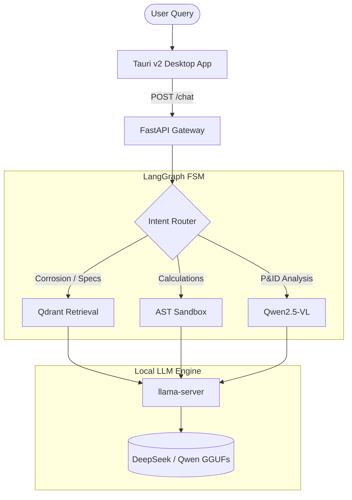

# 🛡️ Dravexis AI

<div align="center">


**SIH 2026 | PS 26117 / PS 117 | Sovereign AI Workbench**<br>
A sovereign on-premise, air-gappable agentic RAG stack for refinery knowledge retrieval and decision support.

</div>

---

## ⚠️ Prototype Disclaimer & Honest Capabilities

This is a **CPU-functional prototype** running on 4 GB VRAM dev hardware. We believe in stating our boundaries truthfully:

- **GPU Offload:** `CPU_FALLBACK_OR_NO_GPU_OFFLOAD` — VRAM is insufficient for concurrent models.
- **Sandbox:** `DEGRADED_SANDBOX` — Uses strict AST allowlist filtering (Docker not installed on dev machine).
- **Network Monitor:** `MONITOR_UNAVAILABLE` for packet-level capture (no NPCAP installed; psutil socket-level only).
- **Vision:** `VISION_AVAILABLE` — Qwen2.5-VL-3B runs on CPU fallback (~9–14s cold-start).
- **Model Hot-Swapping:** Models are loaded sequentially. Reasoning and code generation never run co-resident to respect the 4GB memory budget.

---

## ⚡ Quick Start

```bat
:: Double-click from project root OR run from CMD/PowerShell:
launch_dravexis.bat
```

This single robust launcher:
- Checks prerequisites (Python, npm, binaries, GGUF models).
- Detects duplicate services to skip redundant backend launches.
- Starts the `llama-server + FastAPI` backend with bounded health polling.
- Launches the stunning GSAP-powered Tauri UI.
- Prints a truthful capability summary on every run.

> **Manual start (if preferred):**
> ```powershell
> # Terminal 1: Backend
> .\scripts\start_all.ps1
> 
> # Terminal 2: UI
> cd ui\mrpl-workbench
> npm run tauri dev
> ```

---

## 🏗️ Architecture & Stack

Dravexis AI orchestrates a sequential agentic workflow via a finite state machine, grounding responses in a local vector database. 



### ⚙️ Core Stack
| Component | Technology | Port |
|---|---|---|
| **LLM Server** | `llama-server` (llama.cpp) | `127.0.0.1:8080` |
| **API Gateway** | FastAPI + Uvicorn | `127.0.0.1:8000` |
| **Embeddings** | FastEmbed BGE-large-en-v1.5 (dim=1024) | in-process |
| **Vector Store** | Qdrant Embedded (on-disk) | in-process |
| **Frontend** | React 19 + Tauri v2 (Rust) + GSAP | `localhost:5173` |

---

## 🛠️ Setup & Installation

### 1. Python Environment
Install Python 3.11+, then install the backend dependencies:
```powershell
pip install -r requirements.txt
```

### 2. llama-server Engine
```powershell
.\scripts\download_llama_server.ps1
```
*(Offline? Download `llama-*-bin-win-cuda12-*-x64.zip` from ggml-org/llama.cpp and place `llama-server.exe` in `bin\`)*

### 3. GGUF Models (Quantized)
We use the highly efficient **DeepSeek-R1-Distill-Qwen-1.5B** and **Qwen2.5-Coder/VL** variants. 
```powershell
.\scripts\download_model.ps1
.\scripts\download_coder_model.ps1
.\scripts\download_vision_model.ps1
```

---

## 📚 Knowledge Retrieval (RAG)

Dravexis AI uses advanced embedding chunking strategies to parse highly technical MRPL refinery documents.

| Parameter | Value | Rationale |
|---|---|---|
| **Chunk size** | 512 tokens (~2048 chars) | Sweet spot for BGE-M3 on technical text. |
| **Overlap** | 64 tokens (~256 chars) | Prevents context loss at boundary edges. |
| **Table handling** | Whole chunk if ≤800 chars | Preserves critical structured engineering data. |
| **Sentence snapping** | Yes (within 20%) | Maintains clean semantic boundaries. |

---

## 🔒 Security & Telemetry

Dravexis AI is built for environments where data cannot leave the room. 
- The **Network Monitor** (`/network/monitor/summary`) actively tracks loopback processes.
- **No external API calls** are made during execution.
- Project checkpoints, logs, and evidence JSONs are automatically excluded via `.gitignore` to prevent data leakage.
